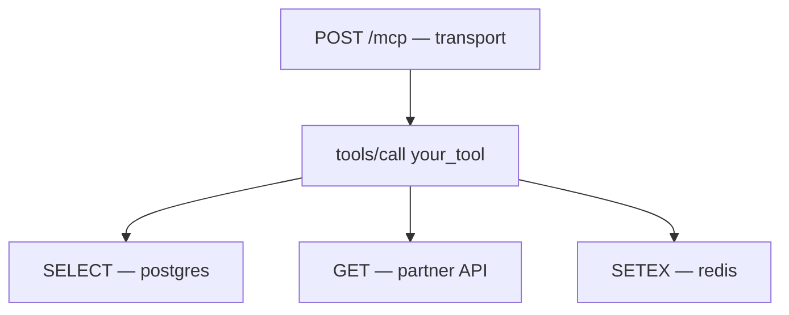

# Traces and spans

A **span** is one unit of work with a start, a duration and a status. A
**trace** is a set of spans linked by a shared trace id, forming a tree.

For MCP, the tree usually looks like this:

## Which span is the root

The root is the span whose parent is **absent from the trace** — not simply the
one with no parent id. An instrumented MCP *client* makes your server's span a
legitimate child of a span you never received, and treating "has a parent id" as
"is not a root" would leave such traces with no root at all.

## Ordering

Spans are returned parent-before-child, siblings in start order. This matters
more than it sounds: children frequently reach storage *before* their parents,
because a parent span cannot end until its children have. Ordering by arrival
would show a child above its own parent.

## Self-time

`self_ms` is a span's duration minus the sum of its children. A tool with 500ms
duration and 10ms self-time is not slow — it is waiting on something that is.

## Latency eligibility

Not every span belongs in a latency percentile. A `subscriptions/listen` span
measures a stream's lifetime, which may be hours; averaged with tool calls it
destroys a p95. Such spans are marked ineligible at write time, so a reader
cannot forget to exclude them. See [Latency and clock accuracy](latency.md).
