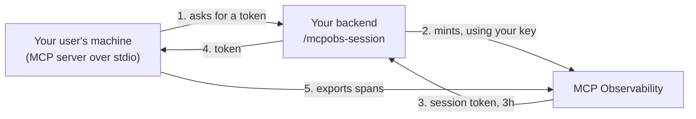

# Session tokens for stdio servers

If your MCP server runs over **stdio**, the client launches it on your user's
own machine. That means any credential you put in the client config is a
credential on someone else's laptop:

```json
{"mcpServers": {"acme": {"command": "...", "env": {
  "OTEL_EXPORTER_OTLP_HEADERS": "x-api-key=mcpo_live_..."}}}}
```

That file gets synced, backed up, and pasted into support tickets. The key in it
is **organisation-wide and never expires**, so a single copy lets anyone write
telemetry into your account indefinitely.

Session tokens fix this. Your backend holds the long-lived key; your users'
machines only ever hold a token that expires in three hours.

!!! danger "Authenticate your session endpoint"

    The endpoint below mints credentials for your organisation. If you expose it
    without authentication, anyone who finds the URL can mint one — which is
    **worse** than the static key you started with, because it is self-service.

    Put it behind whatever already authenticates your users.

## How it fits together



Your long-lived key never leaves step 2.

## 1. Issue a session-minting key

```bash
python scripts/admin.py key --org acme --project prod --scopes session
```

`session` is its own scope. A key that can mint sessions can mint one for **any**
of your users, so it is deliberately not something an `ingest` key can do —
otherwise every key in your deployment config would be a credential factory.

Keep this key on your servers. It is the one thing this design exists to protect.

## 2. Add an endpoint to your application

One handler, behind your existing authentication:

```python
@app.get("/mcpobs-session")
def mcpobs_session(user = Depends(current_user)):     # (1)!
    response = httpx.post(
        "https://ingest.example.io/v1/sessions",
        headers={"x-api-key": MCPOBS_SESSION_KEY},    # (2)!
        json={
            "subject": user.id,
            "attributes": {"user_id": user.id, "workspace": user.workspace},
        },
        timeout=10,
    )
    response.raise_for_status()
    return response.json()                            # (3)!
```

1.  **This is the important line.** Your own authentication decides who gets a
    token. We never see your users.
2.  Server-side only. This is the credential that must not reach a laptop.
3.  Pass our response through unchanged — the SDK expects its exact shape.

**Cache the result per user** for the token's lifetime. Without caching, a user
running five MCP servers makes five calls every three hours.

### The response

```json
{
  "token": "eyJhbGciOi...",
  "expires_in": 10800,
  "endpoint": "https://ingest.example.io"
}
```

`expires_in` is **relative**, not a timestamp, because laptop clocks are
routinely wrong by minutes and a skewed one would refresh at the wrong moment.

## 3. Point the server at your endpoint

```json
{"mcpServers": {"acme": {"command": "python", "args": ["-m", "your_server"],
  "env": {
    "MCPOBS_SESSION_ENDPOINT": "https://acme.com/mcpobs-session",
    "MCPOBS_SESSION_HEADERS": "authorization=Bearer ${USER_TOKEN}"
  }}}}
```

`MCPOBS_SESSION_HEADERS` is whatever your endpoint needs to identify the user —
typically the session token your app already issued them. That is a **user**
credential, not an organisation-wide one, which is the whole difference.

## Attributes

Bound to the token when it is minted, and stamped onto every span from the
token — never from what the client sends. A user cannot attribute their traffic
to somebody else.

| Attribute | |
| --- | --- |
| `user_id` | |
| `user_name` | |
| `workspace` | |
| `tenant_label` | |
| `session_label` | |

An unsupported key is refused by name rather than silently dropped, and the set
is capped at 512 bytes because it travels on every request.

!!! warning "These are personal data"

    `user_id` and `user_name` end up in stored telemetry. Attach only what you
    need, and only what your privacy policy covers. They are searchable by exact
    match; they are deliberately not offered as dropdown values.

## What happens when things break

| | |
| --- | --- |
| **Your endpoint is down at startup** | The server starts **without telemetry** and retries with backoff. Your tool keeps working — our availability is never allowed to affect yours. |
| **A refresh fails** | The current token keeps being used. It is valid for another 25% of its life, so a transient costs nothing. |
| **The token expires anyway** | Telemetry pauses and resumes when the endpoint recovers. Diagnostics go to stderr, never stdout — on stdio, stdout is the protocol. |
| **Our API is down** | Serve your last cached token. Your users keep reporting until it expires. |

Refresh happens at 75% of the token's life, with jitter, so a fleet of machines
started at the same moment does not refresh in lockstep and flood your
authentication service.

## When you do not need this

Session tokens are for servers running on machines you do not control. If your
MCP server runs on **your own infrastructure** over HTTP, a long-lived ingest
key is fine — it never leaves your servers, which is the property that matters.

For local development, a direct key is simpler. Do not ship it.
